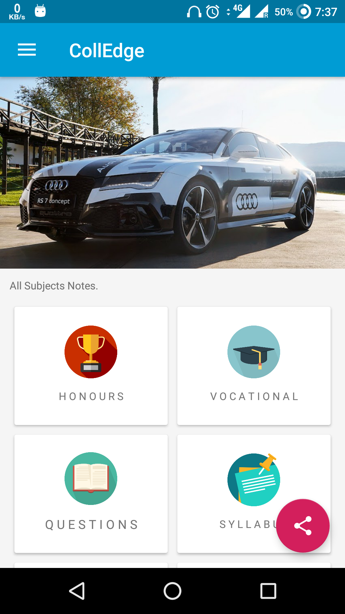
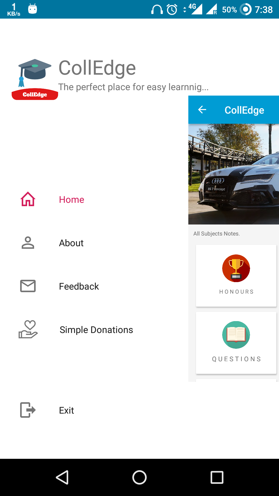
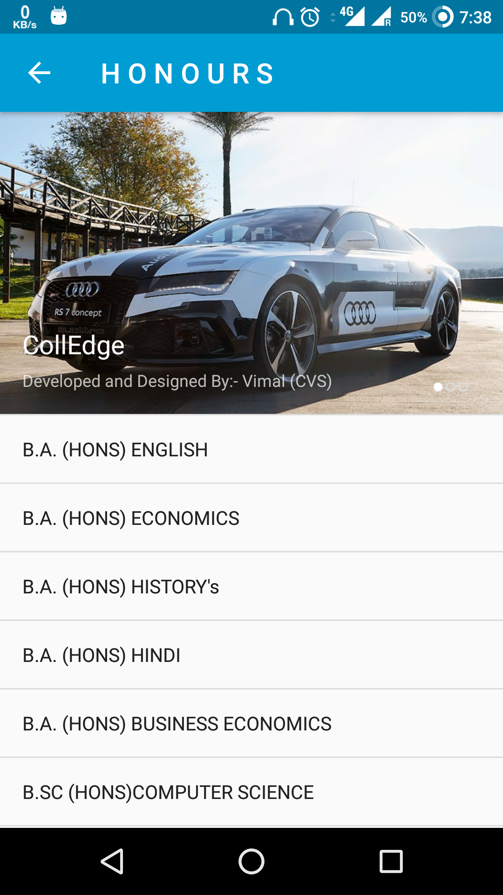
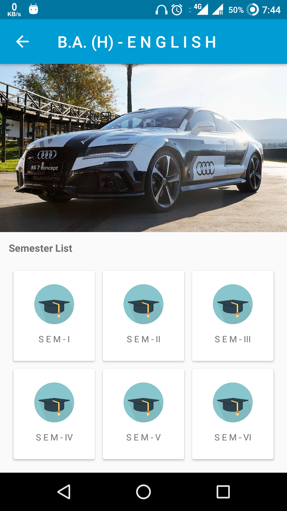

# CollEdge
<b>CollEdge</b>The perfect place of learning App.

This application has collection of DU's Books. Short Notes Previous year Question papers & Solutions absolutely FREE..


   

<a href="https://play.google.com/store/apps/details?id=com.vimalcvs.colledge">

</a>

----------


<b><b>Honours Courses:</b></b><br>
<b>•</b> B.A. (HONS) ENGLISH.<br>
<b>•</b> B.A. (HONS) ECONOMICS.<br>
<b>•</b> B.A. (HONS) HISTORY's.<br>
<b>•</b> B.A. (HONS) HINDI.<br>
<b>•</b> B.A. (HONS) BUSINESS ECONOMICS.<br>
<b>•</b> B.SC (HONS)COMPUTER SCIENCE.<br>
<b>•</b> BACHELOR OF COMMERCE (HONS).<br>


<b><b>Vocational Courses:</b></b><br>
<b>•</b> B.A. (VS) TOURISM MANAGEMENT.<br>
<b>•</b> B.A. (VS) MATERIALS MANAGEMENT.<br>
<b>•</b> B.A. (VS) HUMAN RESOURCE MANAGEMENT.<br>
<b>•</b> B.A. (VS) SMALL AND MEDIUM ENTERPRISES.<br>
<b>•</b> B.A. (VS) MANAGEMENT AND MARKETING OF INSURANCE.<br>
<b>•</b> B.A. (VS) OFFICE MANAGEMENT AND SECRETARIAL PRACTICE.<br>
<b>•</b> B.A. (VS) MARKETING MANAGEMENT AND RETAIL BUSINESS.<br>
<b>•</b> BACHELOR OF MANAGEMENT STUDIES.<br><br>
	


<b>Below are the features of this App:</b><br>	
<b>•</b>More than 100+ NOTE BOOKS...,<br>
<b>•</b>More than 250 exam questions for last 10 years with solutions, <br>

<br>Download now in your mobiles & tablets it's FREE and Up your performance level!
<br>
No permission no ads.<br>

### CONTACT US
<b>•</b> <u>vimalcvs29@gmail.com</u>

### SCREENSHOTS




### LICENSE
```
CollEdge is free software: you can redistribute it and/or modify
it under the terms of the GNU General Public License as published by
the Free Software Foundation, either version 3 of the License, or
(at your option) any later version.

Database Management System is distributed in the hope that it will be useful,
but WITHOUT ANY WARRANTY; without even the implied warranty of
MERCHANTABILITY or FITNESS FOR A PARTICULAR PURPOSE. See the
GNU General Public License for more details.
 
You should have received a copy of the GNU General Public License
along with this program.  If not, see
<http://www.gnu.org/licenses/>.
```
<b>• NOTE:</b> This software depends on other packages that may be licensed under different open source licenses.
----------
